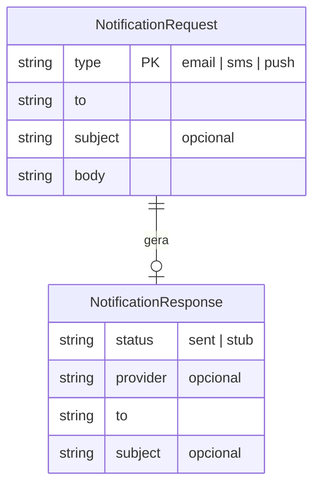

# Data Model — ecom-notification-service

> Documento vivo do modelo de dados. Atualizado sempre que uma entidade for criada, alterada ou removida.
> **Ultima atualizacao:** 2025-03-15

---

## Indice

- [Visao Geral](#visao-geral)
- [Diagrama ER](#diagrama-er)
- [Entidades](#entidades)
- [Enums e Dominio de Valores](#enums-e-dominio-de-valores)
- [Indices e Performance](#indices-e-performance)
- [Classificacao de Privacidade](#classificacao-de-privacidade)
- [Decisoes de Modelagem](#decisoes-de-modelagem)

---

## Visao Geral

O servico de notificacao e stateless — nao possui banco de dados proprio. O modelo de dados descrito aqui reflete os **contratos de entrada e saida** da API e as estruturas trafegadas entre as camadas internas. As entidades sao transientes: existem apenas durante o ciclo de vida da requisicao.

**Banco de dados:** Nenhum (servico stateless)
**ORM / acesso:** N/A
**Extensoes relevantes:** N/A

---

## Diagrama ER

> Nao ha persistencia. O relacionamento e logico: uma requisicao gera uma resposta no mesmo ciclo.

---

## Entidades

---

### NotificationRequest

> Representa a requisicao de envio de uma notificacao recebida via HTTP ou (futuramente) via mensageria.

**Tabela:** N/A — estrutura transient em memoria
**Servico responsavel:** ecom-notification-service

| Campo | Tipo | Nullable | Default | Descricao |
|-------|------|----------|---------|-----------|
| `type` | string | Nao | — | Tipo da notificacao. Ver enum [NotificationType](#notificationtype) |
| `to` | string | Nao | — | Destinatario (e-mail, numero de telefone ou token push) |
| `subject` | string | Sim | — | Assunto. Obrigatorio quando type = email |
| `body` | string | Nao | — | Corpo da mensagem |

**Constraints:**
- `type` deve ser um dos valores do enum NotificationType
- `subject` e obrigatorio quando `type = 'email'` (validado via Joi `.when()`)
- Sem persistence — os dados sao validados e imediatamente processados ou descartados

**Relacionamentos:**
- Uma `NotificationRequest` produz uma `NotificationResponse`

---

### NotificationResponse

> Resposta retornada ao cliente apos o processamento da requisicao.

**Tabela:** N/A — estrutura transient em memoria
**Servico responsavel:** ecom-notification-service

| Campo | Tipo | Nullable | Default | Descricao |
|-------|------|----------|---------|-----------|
| `status` | string | Nao | — | Status do envio. `sent` para email stub, `stub` para SMS/Push nao implementados |
| `provider` | string | Sim | — | Identificador do provider utilizado (`stub` para email) |
| `to` | string | Nao | — | Eco do destinatario enviado |
| `subject` | string | Sim | — | Eco do assunto (apenas para email) |

---

## Enums e Dominio de Valores

### NotificationType

Usado em: `NotificationRequest.type`

| Valor | Significado |
|-------|-------------|
| `email` | Notificacao por e-mail |
| `sms` | Notificacao por SMS |
| `push` | Notificacao push (mobile / web) |

---

### NotificationStatus

Usado em: `NotificationResponse.status`

| Valor | Significado |
|-------|-------------|
| `sent` | Envio processado com sucesso (email stub) |
| `stub` | Canal nao implementado — retorno placeholder (SMS / Push) |

---

## Indices e Performance

Nao aplicavel — servico stateless sem banco de dados.

---

## Classificacao de Privacidade

> Campos sensiveis nunca devem ser expostos via API publica ou retornados em listagens.
> Como o servico e stateless e nao persiste dados, a classificacao se aplica aos campos trafegados nas requisicoes/respostas.

| Campo | Entidade | Classificacao | Justificativa |
|-------|----------|---------------|---------------|
| `to` | NotificationRequest | Pessoal | Pode conter e-mail ou numero de telefone — identificador direto |
| `body` | NotificationRequest | Pessoal | Conteudo da mensagem pode conter dados pessoais |

**Regras gerais:**
- O servico nao persiste nenhum dado em banco — os campos sao processados em memoria e descartados
- Nao ha logging de corpos de mensagem em producao (apenas stub em desenvolvimento)
- Toda comunicacao com provedores externos deve usar TLS

---

## Decisoes de Modelagem

### ADR-DM-001 — Stateless sem banco de dados

| Campo | Detalhe |
|-------|---------|
| **Status** | Aceita |
| **Data** | 2025-03-01 |
| **Contexto** | Decisao arquitetural de manter o servico de notificacao sem persistencia propria, delegando o rastreamento de envios para um servico de eventos/auditoria externo |
| **Decisao** | Nao implementar banco de dados no servico de notificacao. As requisicoes sao validadas, processadas e descartadas. O unico registro de saida e o log (stub) ou a confirmacao do provedor |
| **Alternativas consideradas** | Usar MongoDB para armazenar historico de envios. Descartado por complexidade desnecessaria — o dominio nao exige consulta a historico |
| **Consequencias** | Menor latencia (sem IO de banco), facil escalabilidade horizontal, mas sem capacidade de replay ou auditoria interna sem servico externo |

### ADR-DM-002 — Validacao condicional de subject no controller

| Campo | Detalhe |
|-------|---------|
| **Status** | Aceita |
| **Data** | 2025-03-01 |
| **Contexto** | O campo `subject` e obrigatorio apenas para notificacoes do tipo `email`. Para SMS e push o assunto nao faz sentido |
| **Decisao** | Utilizar `Joi.when()` para aplicar a validacao condicional no schema, eliminando a necessidade de if/else na camada de controller |
| **Alternativas consideradas** | Validar manualmente no controller apos o schema base. Descartado por duplicar logica de validacao |
| **Consequencias** | Regra de negocio de validacao centralizada no schema Joi, facil de testar e modificar |
