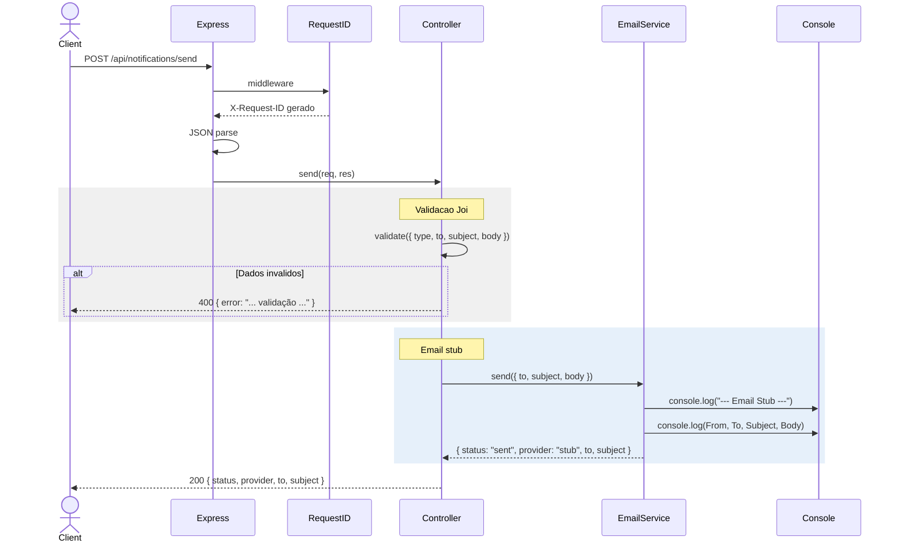
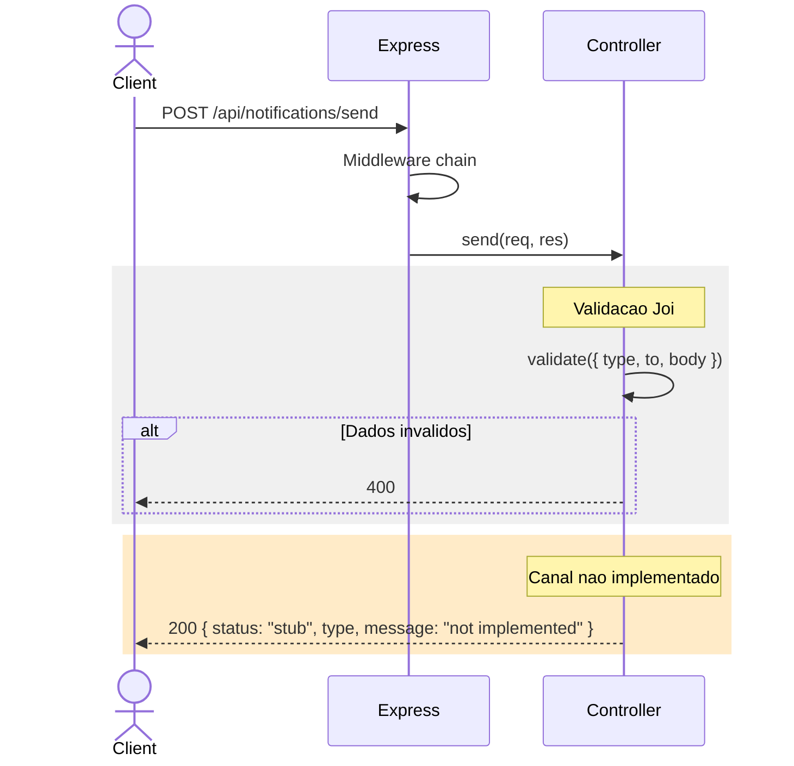

# System Feature Flows

> Registro historico e incremental dos fluxos internos de cada funcionalidade.
> Este documento cresce a cada nova feature implementada e **nunca tem secoes removidas**.

---

## Indice

- [Visao Geral da Arquitetura](#visao-geral-da-arquitetura)
- [Convencoes deste Documento](#convencoes-deste-documento)
- [Feature: Envio de Notificacao](#feature-envio-de-notificacao)
- [Feature: Consumo RabbitMQ](#feature-consumo-rabbitmq)

---

## Visao Geral da Arquitetura

**Padrao arquitetural:** Layered Architecture (routes -> controllers -> services)

**Fluxo global de uma requisicao:**

```
HTTP Request
    └── Middleware (Request ID, JSON parse)
            └── Controller (validacao Joi + dispatch)
                    └── Service (stub — console.log / retorno placeholder)
```

**Camadas e responsabilidades:**

| Camada | Responsabilidade |
|--------|------------------|
| `middleware` | X-Request-ID, error handler padronizado |
| `routes` | Mapeamento HTTP para controllers |
| `controllers` | Validacao Joi do payload, dispatch por tipo de notificacao |
| `services` | Logica de envio (stub) |
| `consumers` | Consumo de mensagens RabbitMQ (stub) |

---

## Convencoes deste Documento

- **Respostas de erro** seguem envelope unificado: `{ data: null, error: { code, message, details }, meta: { requestId } }`
- **Todas as requisicoes** recebem um `X-Request-ID` unico, seja do header do cliente ou gerado internamente via `crypto.randomUUID()`
- **Stubs** sao implementacoes placeholder que logam no console ou retornam mensagem "not implemented"
- **Validacao** e centralizada no controller com Joi — o schema usa `.when()` para regras condicionais

---

---

# Feature: Envio de Notificacao

> **Versao:** 1.0.0
> **Implementada em:** 2025-03-01
> **Status:** Concluida

---

## Resumo

Permite que servicos internos (checkout, auth, etc.) disparem notificacoes transacionais para usuarios. Atualmente o envio de e-mail e funcional como stub (log no console); SMS e Push retornam resposta de "nao implementado".

**Motivacao:** Servicos do e-commerce precisam notificar usuarios sobre confirmacao de pedido, reset de senha, alertas de pagamento, etc. sem depender de provedores externos durante o desenvolvimento.

**Resultado:** API REST funcional para integracao entre servicos, com contrato estavel mesmo que os canais de envio reais ainda nao estejam implementados.

---

## Fluxo Principal

### 1. Ponto de Entrada

- **Tipo:** HTTP REST
- **Arquivo:** `src/routes/notification.routes.js`
- **Rota/Evento:** `POST /api/notifications/send`
- **Autenticacao:** Publica (ambiente interno)

A requisicao chega no `Router` do Express e e delegada ao metodo `send` do `NotificationController`.

---

### 2. Validacao de Entrada

- **Arquivo:** `src/controllers/notification.controller.js`
- **Biblioteca:** Joi 17

| Campo | Tipo | Obrigatorio | Regra de validacao |
|-------|------|-------------|---------------------|
| `type` | string | Sim | Deve ser `email`, `sms` ou `push` |
| `to` | string | Sim | Qualquer string nao vazia |
| `subject` | string | Condicional | Obrigatorio quando `type = 'email'` (via `Joi.when()`) |
| `body` | string | Sim | Qualquer string nao vazia |

**Falha de validacao:** retorna HTTP 400 com a mensagem de erro do Joi no formato `{ error: "mensagem" }`.

---

### 3. Orquestracao da Aplicacao

- **Arquivo:** `src/controllers/notification.controller.js`

1. Controller recebe `req.body` apos middlewares (JSON parse + Request ID)
2. Executa `sendSchema.validate(req.body)` com Joi
3. Se falhar -> retorna 400 com mensagem de erro
4. Se `type = 'email'`:
   - Instancia `EmailService` e chama `send({ to, subject, body })`
   - EmailService loga os dados no console e retorna `{ status: "sent", provider: "stub", to, subject }`
   - Controller retorna 200 com o resultado
5. Se `type = 'sms'` ou `type = 'push'`:
   - Controller retorna 200 com `{ status: "stub", type, message: "not implemented" }`

---

### 4. Regras de Negocio

| Regra | Descricao | Localizacao no Codigo |
|-------|-----------|----------------------|
| Subject obrigatorio para email | O campo `subject` e exigido apenas para notificacoes do tipo email | `src/controllers/notification.controller.js:7` |
| Canal nao implementado retorna stub | SMS e Push retornam status "stub" com mensagem "not implemented" sem processamento | `src/controllers/notification.controller.js:31` |
| Provider identificado na resposta | O campo `provider` indica qual mecanismo foi usado (`stub`) | `src/services/email.service.js:12` |

---

### 5. Persistencia / Integracoes

**Integracoes externas:**

| Servico | Operacao | Timeout | Retry |
|---------|----------|---------|-------|
| Email (stub) | `console.log` | N/A | N/A |

Nao ha persistencia — o servico e stateless.

---

### 6. Resposta Final

**Sucesso — `200`: email**

```json
{
  "status": "sent",
  "provider": "stub",
  "to": "usuario@exemplo.com",
  "subject": "Confirmacao de Pedido"
}
```

**Sucesso — `200`: sms / push**

```json
{
  "status": "stub",
  "type": "sms",
  "message": "not implemented"
}
```

**Campos retornados:**

| Campo | Tipo | Descricao |
|-------|------|-----------|
| `status` | string | `sent` (email) ou `stub` (sms/push) |
| `provider` | string | Eco do provider utilizado |
| `to` | string | Eco do destinatario (apenas email) |
| `subject` | string | Eco do assunto (apenas email) |
| `type` | string | Tipo original (apenas sms/push) |
| `message` | string | Texto explicativo (apenas sms/push) |

---

## Fluxos Alternativos e Erros

| Cenário | HTTP Status | Codigo de Erro | Mensagem |
|---------|-------------|----------------|----------|
| Campos obrigatorios ausentes | 400 | N/A | `"\"body\" is required"` |
| Tipo invalido | 400 | N/A | `"\"type\" must be one of [email, sms, push]"` |
| Subject ausente para email | 400 | N/A | `"\"subject\" is required"` |

> **Importante:** Atualmente os erros retornam o formato simplificado `{ error: "mensagem" }`. O middleware `error-handler.js` usa o formato padrao `{ data, error, meta }` com requestId, mas nao e acionado para erros de validacao tratados explicitamente no controller.

---

## Diagrama de Sequencia

### Fluxo de envio de e-mail



### Fluxo de envio de SMS / Push



---

## Decisoes Tecnicas

### ADR-001 — Stub de e-mail com console.log

| Campo | Detalhe |
|-------|---------|
| **Status** | Aceita |
| **Data** | 2025-03-01 |
| **Contexto** | Necessidade de disponibilizar a API para integracao entre servicos antes de contratar provedor SMTP |
| **Decisao** | Implementar envio de e-mail como stub que loga os dados no console e retorna status "sent" |
| **Consequencias** | Permite desenvolvimento paralelo dos servicos consumidores; o contrato da API ja reflete o comportamento final (rota, payload, resposta) |

### ADR-002 — Validacao Joi com Joi.when() para subject condicional

| Campo | Detalhe |
|-------|---------|
| **Status** | Aceita |
| **Data** | 2025-03-01 |
| **Contexto** | O campo `subject` so faz sentido para e-mails, mas o schema precisa rejeitar requisicoes de email sem assunto |
| **Decisao** | Usar `Joi.string().when('type', { is: 'email', then: Joi.required(), otherwise: Joi.optional() })` |
| **Consequencias** | Regra de negocio declarativa dentro do schema, sem if/else no controller |

### ADR-003 — SMS e Push como stub simples no controller

| Campo | Detalhe |
|-------|---------|
| **Status** | Aceita |
| **Data** | 2025-03-01 |
| **Contexto** | SMS e Push ainda nao serao implementados, mas precisam de contrato de API definido |
| **Decisao** | Retornar `{ status: "stub", type, message: "not implemented" }` diretamente do controller, sem instanciar services |
| **Consequencias** | Sem complexidade desnecessaria de services vazios; facil remover o stub quando a implementacao real chegar |

---

## Trechos de Codigo Relevantes

### Schema de validacao com Joi.when()

```javascript
const sendSchema = Joi.object({
  type: Joi.string().valid('email', 'sms', 'push').required(),
  to: Joi.string().required(),
  subject: Joi.string().when('type', {
    is: 'email',
    then: Joi.required(),
    otherwise: Joi.optional(),
  }),
  body: Joi.string().required(),
});
```

### Dispatcher por tipo

```javascript
if (value.type === 'email') {
  const result = await this.emailService.send({ ... });
  return res.json(result);
}
return res.json({ status: 'stub', type: value.type, message: 'not implemented' });
```

---

---

# Feature: Consumo RabbitMQ

> **Versao:** 0.1.0
> **Implementada em:** 2025-03-01
> **Status:** Em andamento (placeholder)

---

## Resumo

Estrutura inicial para consumo assincrono de mensagens de notificacao via RabbitMQ. Atualmente apenas a classe `NotificationConsumer` existe com logica condicional: se `RABBITMQ_URL` estiver configurada, exibe log indicando que o servico tentara conectar — mas nao estabelece conexao real.

**Motivacao:** Preparar a arquitetura para processamento assincrono, permitindo que servicos publiquem notificacoes em fila sem aguardar resposta sincrona.

**Resultado:** Estrutura de consumer pronta para implementacao real; integracao atual e inexistente (stub).

---

## Fluxo Principal

### 1. Ponto de Entrada

- **Tipo:** Inicializacao do servico
- **Arquivo:** `src/index.js`
- **Disparo:** Ao iniciar o servico Node, apos carregar config

`index.js` instancia `NotificationConsumer` e chama `start()`.

---

### 2. Orquestracao

- **Arquivo:** `src/consumers/notification.consumer.js`

1. `config.rabbitmqUrl` e verificado
2. Se URL for falsy ou igual a `amqp://localhost:5672` (padrao dev), exibe log "no RABBITMQ_URL configured, skipping" e retorna sem fazer nada
3. Se URL personalizada for fornecida, exibe log "connecting to <url>" seguido de "stub mode — not implemented"

---

### 3. Resposta Final

Nao ha resposta — o metodo `start()` nao retorna valor. Apenas logs no console.

---

## Fluxos Alternativos e Erros

| Cenário | Comportamento |
|---------|---------------|
| `RABBITMQ_URL` nao definido | Loga "no RABBITMQ_URL configured, skipping" |
| `RABBITMQ_URL` = `amqp://localhost:5672` | Loga "no RABBITMQ_URL configured, skipping" |
| `RABBITMQ_URL` personalizado | Loga "connecting to <url>" e "stub mode — not implemented" |

---

## Decisoes Tecnicas

### ADR-004 — Consumer separado dos controllers

| Campo | Detalhe |
|-------|---------|
| **Status** | Aceita |
| **Data** | 2025-03-01 |
| **Contexto** | O consumo de mensagens e um fluxo de entrada diferente (mensageria vs HTTP) que nao deve compartilhar a mesma logica de request/response |
| **Decisao** | Criar classe `NotificationConsumer` em diretorio `consumers/`, independente do fluxo HTTP, que reutiliza os mesmos services |
| **Consequencias** | Separa clara de responsabilidades; facil testar cada fluxo isoladamente; o consumer pode evoluir para suportar multiplas filas |

---

## Trechos de Codigo Relevantes

```javascript
class NotificationConsumer {
  start() {
    if (!config.rabbitmqUrl || config.rabbitmqUrl === 'amqp://localhost:5672') {
      console.log('Notification Consumer: no RABBITMQ_URL configured, skipping');
      return;
    }
    console.log(`Notification Consumer: connecting to ${config.rabbitmqUrl}`);
    console.log('Notification Consumer: stub mode — not implemented');
  }
}
```
